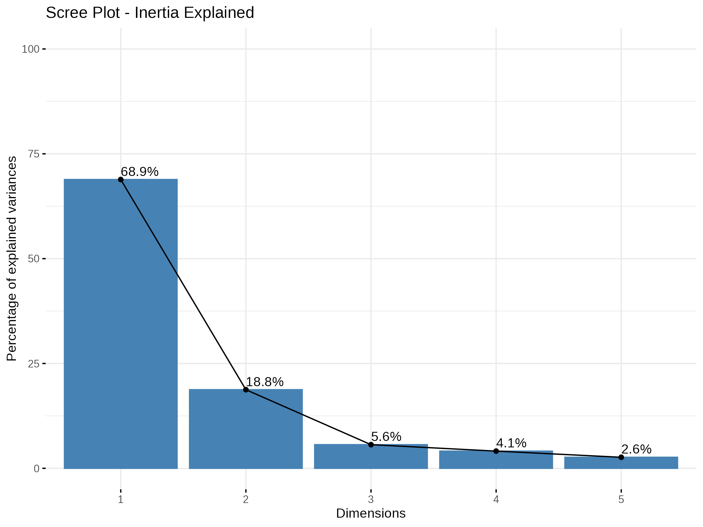
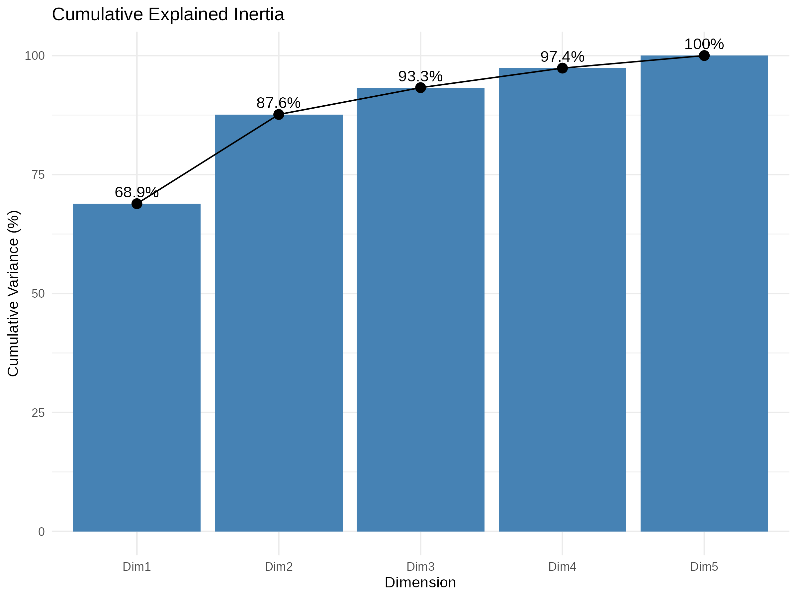
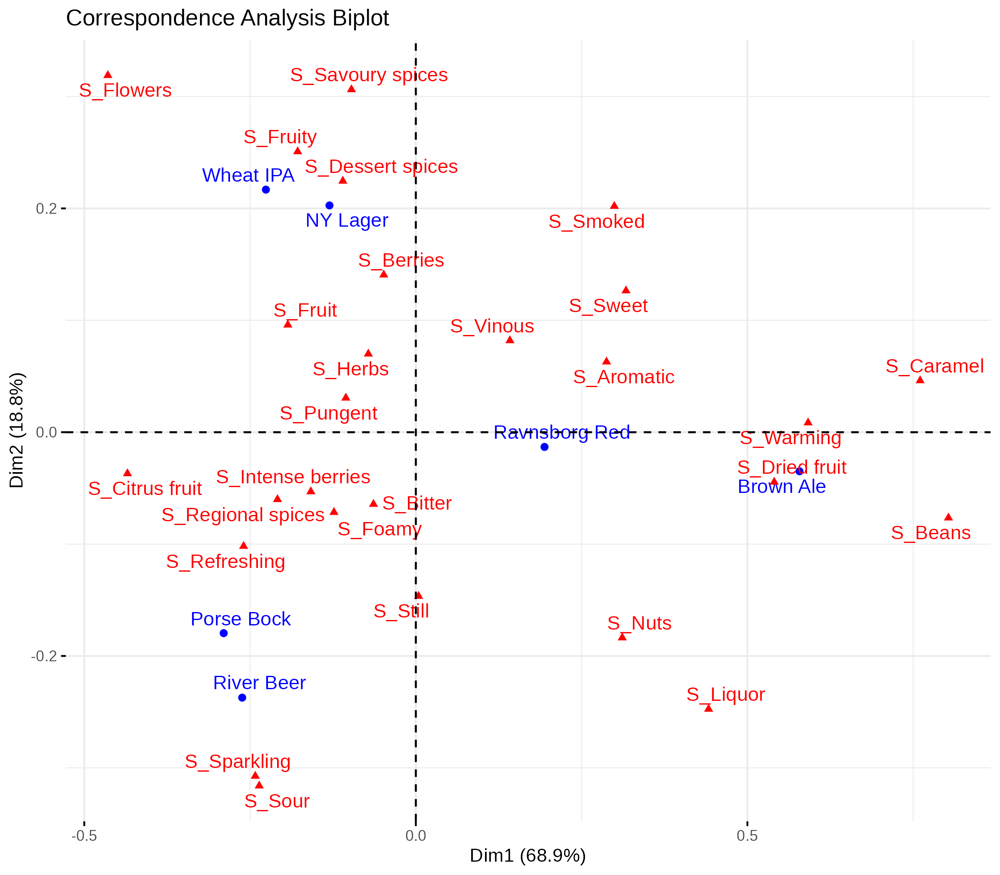
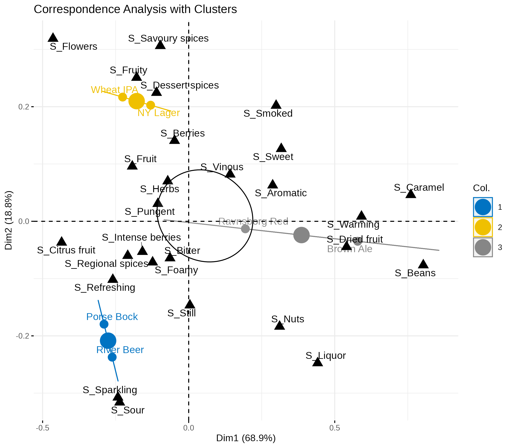

# Correspondence Analysis in R

## Overview

This project applies **Correspondence Analysis (CA)** to explore relationships between categorical variables. Correspondence Analysis is a multivariate statistical technique used to analyze contingency tables and visualize associations between row and column categories in a low-dimensional space.

The analysis was performed in **R**, using packages specialized in multivariate data analysis and visualization.

---

## Objective

The objective of this project is to:

* Explore associations between categorical variables
* Reduce the dimensionality of the contingency table
* Visualize relationships between categories
* Interpret the principal dimensions that explain the variability in the data

Correspondence Analysis allows us to identify patterns and clusters of related categories in a graphical way.

---

## Tools and Libraries

The analysis was conducted using the following tools:

* **R**
* `FactoMineR`
* `factoextra`
* `ggplot2`
* `dplyr`

---

## Methodology

The workflow of the analysis consisted of the following steps:

1. Data preparation and construction of a contingency table
2. Application of Correspondence Analysis
3. Evaluation of explained inertia by dimensions
4. Visualization of the correspondence map
5. Cluster visualization to identify similar categories

---

## Results

### Scree Plot



**Interpretation**

The scree plot shows the proportion of inertia explained by each dimension of the correspondence analysis.

In this analysis:

* The **first dimension explains the largest proportion of inertia**, capturing the main association pattern between the categories.
* The **second dimension explains additional variability**, helping to refine the interpretation.
* After the first few dimensions, the marginal gain in explained inertia becomes small.

This indicates that a **low-dimensional representation (2D)** is sufficient to capture most of the structure in the data.

---

### Cumulative Inertia



**Interpretation**

The cumulative inertia plot shows how much of the total variability is explained as more dimensions are added.

Key observations:

* The first dimensions explain a substantial portion of the total inertia.
* After a small number of dimensions, the curve stabilizes.

This confirms that the **first two dimensions are sufficient to represent the relationships between categories** in a meaningful way.

---

### Correspondence Map



**Interpretation**

The correspondence map provides a visual representation of the associations between categories.

Important points:

* Categories that appear **close to each other** are strongly associated.
* Categories located **far apart** tend to represent different profiles or patterns.
* The position along the axes reflects how categories contribute to each principal dimension.

This map allows us to identify **patterns of association and similarity between categorical levels**.

---

### Cluster Visualization



**Interpretation**

The clustering visualization groups categories based on their proximity in the correspondence space.

This allows us to identify:

* groups of categories with similar profiles
* potential structures or patterns in the contingency table
* relationships that might not be immediately visible in the raw data

Clusters highlight how certain categories share similar relationships with the rest of the dataset.

---

## Project Structure

```
Correspondence-Analysis
│
├── Análise de correspondência.Rmd
├── Análise-de-correspondência.html
├── README.md
│
└── graficos
    ├── scree_plot.png
    ├── cumulative_inertia.png
    ├── ca_biplot.png
    └── ca_clusters.png
```

---

## Author

**Guilherme Henrique**

MSc Student in Statistics – UNESP
Data Science and Statistical Modeling
